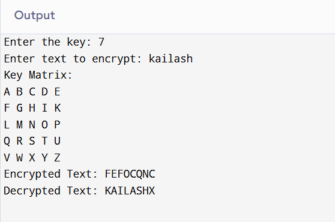

## EX. NO:2 IMPLEMENTATION OF PLAYFAIR CIPHER

 

## AIM:
 

 

To write a C program to implement the Playfair Substitution technique.

## DESCRIPTION:

The Playfair cipher starts with creating a key table. The key table is a 5×5 grid of letters that will act as the key for encrypting your plaintext. Each of the 25 letters must be unique and one letter of the alphabet is omitted from the table (as there are 25 spots and 26 letters in the alphabet).

To encrypt a message, one would break the message into digrams (groups of 2 letters) such that, for example, "HelloWorld" becomes "HE LL OW OR LD", and map them out on the key table. The two letters of the diagram are considered as the opposite corners of a rectangle in the key table. Note the relative position of the corners of this rectangle. Then apply the following 4 rules, in order, to each pair of letters in the plaintext:
1.	If both letters are the same (or only one letter is left), add an "X" after the first letter
2.	If the letters appear on the same row of your table, replace them with the letters to their immediate right respectively
3.	If the letters appear on the same column of your table, replace them with the letters immediately below respectively
4.	If the letters are not on the same row or column, replace them with the letters on the same row respectively but at the other pair of corners of the rectangle defined by the original pair.
## EXAMPLE:


 

## ALGORITHM:

STEP-1: Read the plain text from the user.
STEP-2: Read the keyword from the user.
STEP-3: Arrange the keyword without duplicates in a 5*5 matrix in the row order and fill the remaining cells with missed out letters in alphabetical order. Note that ‘i’ and ‘j’ takes the same cell.
STEP-4: Group the plain text in pairs and match the corresponding corner letters by forming a rectangular grid.
STEP-5: Display the obtained cipher text.


### Program:
```c
#include <stdio.h>
#include <string.h>
#include <ctype.h>

#define SIZE 5

void generateKeyMatrix(char key[], char matrix[SIZE][SIZE]) {
    int alpha[26] = {0};
    int i, j, k = 0;
    char current;

    // Remove duplicates and replace 'J' with 'I'
    for (i = 0; key[i] != '\0'; i++) {
        current = toupper(key[i]);
        if (current == 'J') current = 'I';
        if (current < 'A' || current > 'Z' || alpha[current - 'A'])
            continue;
        alpha[current - 'A'] = 1;
        key[k++] = current;
    }
    key[k] = '\0';

    // Fill matrix with key characters and remaining alphabet
    i = 0; k = 0;
    for (int row = 0; row < SIZE; row++) {
        for (int col = 0; col < SIZE; col++) {
            if (i < strlen(key)) {
                matrix[row][col] = key[i++];
            } else {
                for (char ch = 'A'; ch <= 'Z'; ch++) {
                    if (ch == 'J' || alpha[ch - 'A'])
                        continue;
                    matrix[row][col] = ch;
                    alpha[ch - 'A'] = 1;
                    break;
                }
            }
        }
    }
}

void findPosition(char matrix[SIZE][SIZE], char ch, int *row, int *col) {
    if (ch == 'J') ch = 'I';  // Treat 'J' as 'I'
    for (int i = 0; i < SIZE; i++) {
        for (int j = 0; j < SIZE; j++) {
            if (matrix[i][j] == ch) {
                *row = i;
                *col = j;
                return;
            }
        }
    }
}

void processDigraph(char a, char b, char matrix[SIZE][SIZE], char *resA, char *resB, int encrypt) {
    int row1, col1, row2, col2;
    findPosition(matrix, a, &row1, &col1);
    findPosition(matrix, b, &row2, &col2);

    if (row1 == row2) {  // Same row
        *resA = matrix[row1][(col1 + (encrypt ? 1 : SIZE - 1)) % SIZE];
        *resB = matrix[row2][(col2 + (encrypt ? 1 : SIZE - 1)) % SIZE];
    } else if (col1 == col2) {  // Same column
        *resA = matrix[(row1 + (encrypt ? 1 : SIZE - 1)) % SIZE][col1];
        *resB = matrix[(row2 + (encrypt ? 1 : SIZE - 1)) % SIZE][col2];
    } else {  // Rectangle swap
        *resA = matrix[row1][col2];
        *resB = matrix[row2][col1];
    }
}

void preprocessText(char *text) {
    char temp[100] = {0};
    int k = 0;

    for (int i = 0; text[i]; i++) {
        if (isalpha(text[i])) {
            temp[k++] = toupper(text[i] == 'J' ? 'I' : text[i]);
        }
    }
    temp[k] = '\0';
    strcpy(text, temp);
}

void encryptDecryptText(char *text, char matrix[SIZE][SIZE], int encrypt) {
    preprocessText(text);
    char result[100] = {0};
    int len = strlen(text), k = 0;

    for (int i = 0; i < len; i += 2) {
        char a = text[i];
        char b = (i + 1 < len) ? text[i + 1] : 'X';

        if (a == b) {
            b = 'X';  // Insert 'X' between identical letters
            i--;      // Re-evaluate second character
        }

        char resA, resB;
        processDigraph(a, b, matrix, &resA, &resB, encrypt);
        result[k++] = resA;
        result[k++] = resB;
    }
    result[k] = '\0';
    strcpy(text, result);
}

void printMatrix(char matrix[SIZE][SIZE]) {
    printf("Key Matrix:\n");
    for (int i = 0; i < SIZE; i++) {
        for (int j = 0; j < SIZE; j++) {
            printf("%c ", matrix[i][j]);
        }
        printf("\n");
    }
}

int main() {
    char key[100], text[100], matrix[SIZE][SIZE];
    
    printf("Enter the key: ");
    fgets(key, sizeof(key), stdin);
    key[strcspn(key, "\n")] = '\0';

    printf("Enter text to encrypt: ");
    fgets(text, sizeof(text), stdin);
    text[strcspn(text, "\n")] = '\0';

    generateKeyMatrix(key, matrix);
    printMatrix(matrix);

    encryptDecryptText(text, matrix, 1);  // Encrypt
    printf("Encrypted Text: %s\n", text);

    encryptDecryptText(text, matrix, 0);  // Decrypt
    printf("Decrypted Text: %s\n", text);

    return 0;
}
```
### Output:


### Result:
The given program is executed sucessfully